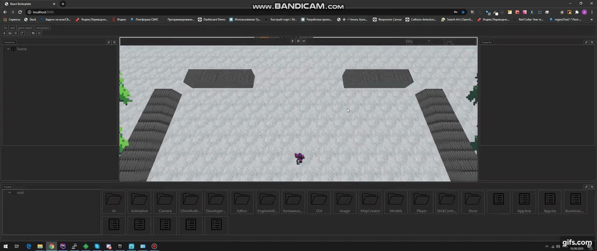
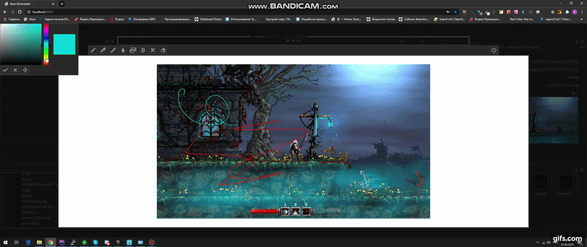
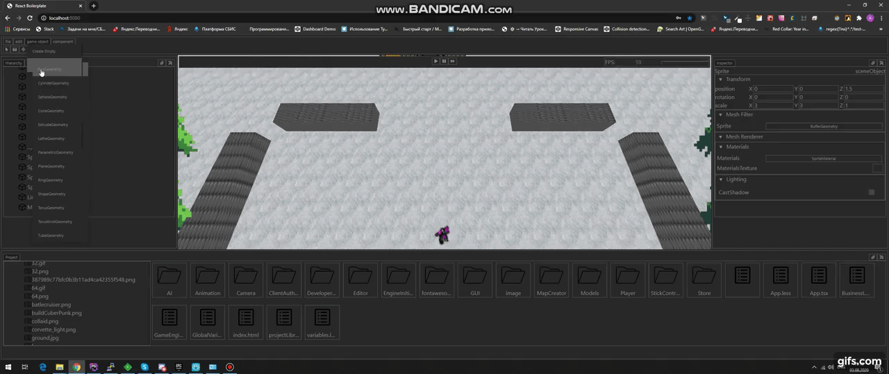
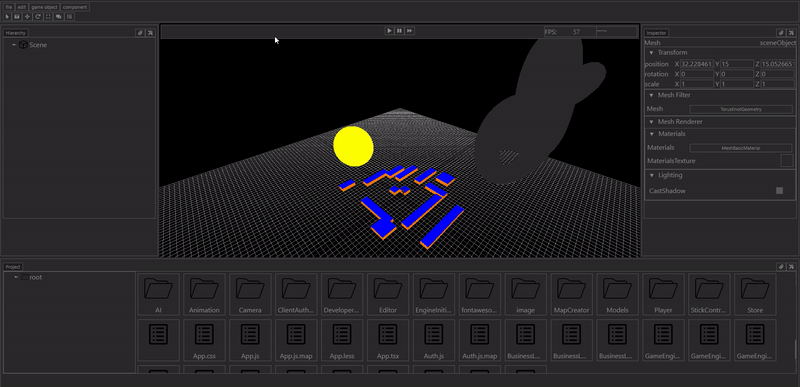

# GameEngine

Game engine project with built-in editor and server
___

___
The editor includes a UI kit
At the moment is in the mode of constant refinement and expansion of functionality

###Code editor:

___
###Image editor:

___
###Ability to create and manipulate 3d and 2d entities:

___
###Camera activation and control mechanism:

